--------------------------------------------------------------------------------------------------------------------
* Table of Contents
{:toc}

--------------------------------------------------------------------------------------------------------------------

## **Introduction**

nustracker is a standalone desktop app that aims to help event directors and administrative personnel of
NUS student organisations to manage the organisation of undergraduate student events more easily.

As this app is geared towards the tech-literate generation, it is designed to use
a Command-Line Interface (CLI) to speed up usage for fast typists, while still making use of a
clean Graphical User Interface (GUI).

NUSTracker allows event directors to manage student events attendance information of the large undergraduate
student base.


--------------------------------------------------------------------------------------------------------------------

## **Acknowledgements**

* {list here sources of all reused/adapted ideas, code, documentation, and third-party libraries -- include links to the original source as well}

--------------------------------------------------------------------------------------------------------------------

## **Setting up, getting started**

Refer to the guide [_Setting up and getting started_](SettingUp.md).

--------------------------------------------------------------------------------------------------------------------

## **Design**

<div markdown="span" class="alert alert-primary">

:bulb: **Tip**: The `.puml` files used to create diagrams in this document can be found in the [diagrams](https://github.com/se-edu/addressbook-level3/tree/master/docs/diagrams/) folder.

</div>

### Architecture


The ***Architecture Diagram*** given above explains the high-level design of the App.

Given below is a quick overview of main components and how they interact with each other.

**Main components of the architecture**

**`Main`** has two classes called [`Main`](https://github.com/se-edu/addressbook-level3/tree/master/src/main/java/seedu/address/Main.java) and [`MainApp`](https://github.com/se-edu/addressbook-level3/tree/master/src/main/java/seedu/address/MainApp.java). It is responsible for,
* At app launch: Initializes the components in the correct sequence, and connects them up with each other.
* At shut down: Shuts down the components and invokes cleanup methods where necessary.

[**`Commons`**](#common-classes) represents a collection of classes used by multiple other components.

The rest of the App consists of four components.

* [**`UI`**](#ui-component): The UI of the App.
* [**`Logic`**](#logic-component): The command executor.
* [**`Model`**](#model-component): Holds the data of the App in memory.
* [**`Storage`**](#storage-component): Reads data from, and writes data to, the hard disk.


**How the architecture components interact with each other**

The *Sequence Diagram* below shows how the components interact with each other for the scenario where the user issues the command `delete id/e1234567`.

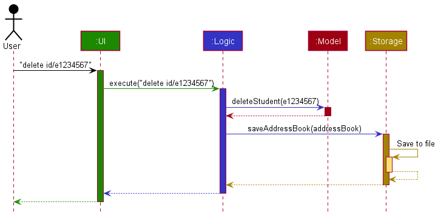
<br>_Sequence diagram of execution of delete id/e1234567_

Each of the four main components (also shown in the diagram above),

* defines its *API* in an `interface` with the same name as the Component.
* implements its functionality using a concrete `{Component Name}Manager` class (which follows the corresponding API `interface` mentioned in the previous point).

For example, the `Logic` component defines its API in the `Logic.java` interface and implements its functionality using the `LogicManager.java` class which follows the `Logic` interface. Other components interact with a given component through its interface rather than the concrete class (reason: to prevent outside component's being coupled to the implementation of a component), as illustrated in the (partial) class diagram below.


The sections below give more details of each component.

### UI component

The **API** of this component is specified in [`Ui.java`](https://github.com/AY2122S1-CS2103T-T11-1/tp/blob/master/src/main/java/nustracker/ui/Ui.java)


The UI consists of a `MainWindow` that is made up of parts e.g.`CommandBox`, `ResultDisplay`, `StudentListPanel`, `StatusBarFooter`, `EventListPanel` etc. All these, including the `MainWindow`, inherit from the abstract `UiPart<T>` class which captures the commonalities between classes that represent parts of the visible GUI.


The `UI` component uses the JavaFX UI framework and heavily utilizes CSS as well. The layout of these UI parts are defined in matching `.fxml` files that are in the `src/main/resources/view` folder. For example, the layout of the [`MainWindow`](https://github.com/AY2122S1-CS2103T-T11-1/tp/blob/master/src/main/resources/view/MainWindow.fxml) is specified in [`MainWindow.fxml`](https://github.com/AY2122S1-CS2103T-T11-1/tp/blob/master/src/main/resources/view/MainWindow.fxml)

The styling for the UI components is controlled by the [`DarkTheme.css`](https://github.com/AY2122S1-CS2103T-T11-1/tp/blob/master/src/main/resources/view/DarkTheme.css) and [`LightTheme.css`](https://github.com/AY2122S1-CS2103T-T11-1/tp/blob/master/src/main/resources/view/LightTheme.css) files. These .css files
are also switched for every component whenever the user requests a change in theme, via the `ThemeApplier`.

The `UI` component,

* executes user commands using the `Logic` component.
* listens for changes to `Model` data so that the UI can be updated with the modified data.
* keeps a reference to the `Logic` component, because the `UI` relies on the `Logic` to execute commands.
* depends on some classes in the `Model` component, as it displays `Student` objects residing in the `Model`.

### Logic component

**API** : [`Logic.java`](https://github.com/se-edu/addressbook-level3/tree/master/src/main/java/seedu/address/logic/Logic.java)

Here's a (partial) class diagram of the `Logic` component:


How the `Logic` component works:
1. When `Logic` is called upon to execute a command, it uses the `AddressBookParser` class to parse the user command.
1. This results in a `Command` object (more precisely, an object of one of its subclasses e.g., `AddCommand`) which is executed by the `LogicManager`.
1. The command can communicate with the `Model` when it is executed (e.g. to add a student).
1. The result of the command execution is encapsulated as a `CommandResult` object which is returned from `Logic`.

The Sequence Diagram below illustrates the interactions within the `Logic` component for the `execute("delete id/e0123456")` API call.


<br>_Detailed sequence diagram for delete id/e0123456_

<div markdown="span" class="alert alert-info">:information_source: **Note:** The lifeline for `DeleteCommandParser` should end at the destroy marker (X) but due to a limitation of PlantUML, the lifeline reaches the end of diagram.
</div>

Here are the other classes in `Logic` (omitted from the class diagram above) that are used for parsing a user command:


How the parsing works:
* When called upon to parse a user command, the `AddressBookParser` class creates an `XYZCommandParser` (`XYZ` is a placeholder for the specific command name e.g., `AddCommandParser`) which uses the other classes shown above to parse the user command and create a `XYZCommand` object (e.g., `AddCommand`) which the `AddressBookParser` returns back as a `Command` object.
* All `XYZCommandParser` classes (e.g., `AddCommandParser`, `DeleteCommandParser`, ...) inherit from the `Parser` interface so that they can be treated similarly where possible e.g, during testing.

### Model component
**API** : [`Model.java`](https://github.com/se-edu/addressbook-level3/tree/master/src/main/java/seedu/address/model/Model.java)

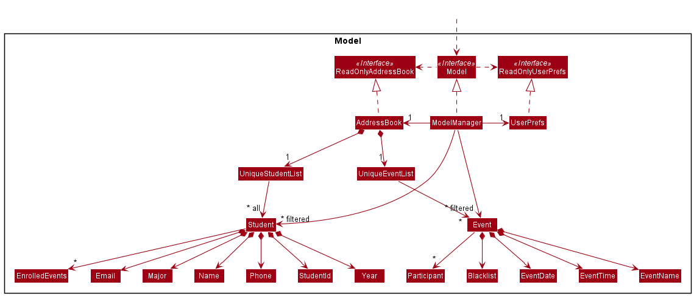

The `Model` component,

* stores the address book data i.e.,
  * all `Student` objects (which are contained in a `UniqueStudentList` object).
  * all `Event` objects (which are contained in a `UniqueEventList` object).
* stores the currently 'selected' `Student` objects (e.g., results of a search query) as a separate _filtered_ list which is exposed to outsiders as an unmodifiable `ObservableList<Student>` that can be 'observed' 
* similarly, stores the currently 'selected' `Event` objects as a separate _filtered_ list which is exposed to outsiders as an unmodifiable `ObservableList<Event>` that can be 'observed' 
* the UI is bound to these lists so the UI can automatically update when the data in either list changes.
* stores a `UserPref` object that represents the user’s preferences. This is exposed to the outside as a `ReadOnlyUserPref` objects.
* does not depend on any of the other three components (as the `Model` represents data entities of the domain, they should make sense on their own without depending on other components)

### Storage component

**API** : [`Storage.java`](https://github.com/se-edu/addressbook-level3/tree/master/src/main/java/seedu/address/storage/Storage.java)


The `Storage` component,
* can save both address book data and user preference data in json format, and read them back into corresponding objects.
* inherits from both `AddressBookStorage` and `UserPrefStorage`, which means it can be treated as either one (if only the functionality of only one is needed).
* depends on some classes in the `Model` component (because the `Storage` component's job is to save/retrieve objects that belong to the `Model`)

### Common classes

Classes used by multiple components are in the `nustracker.commons` package.

--------------------------------------------------------------------------------------------------------------------

## **Implementation**

This section describes some noteworthy details on how certain features are implemented.

### Creating an event
This is a feature to allow the user to create an event. Currently, each event has a name, date, time, participant list and blacklist. Users can specify the name, date and time of an event using the `create` command.

This feature comes with the following classes:
- nustracker.logic.commands.CreateCommand
- nustracker.logic.parser.CreateCommandParser
- nustracker.model.event.*

The following sequence diagram shows how the create operation works:<br>

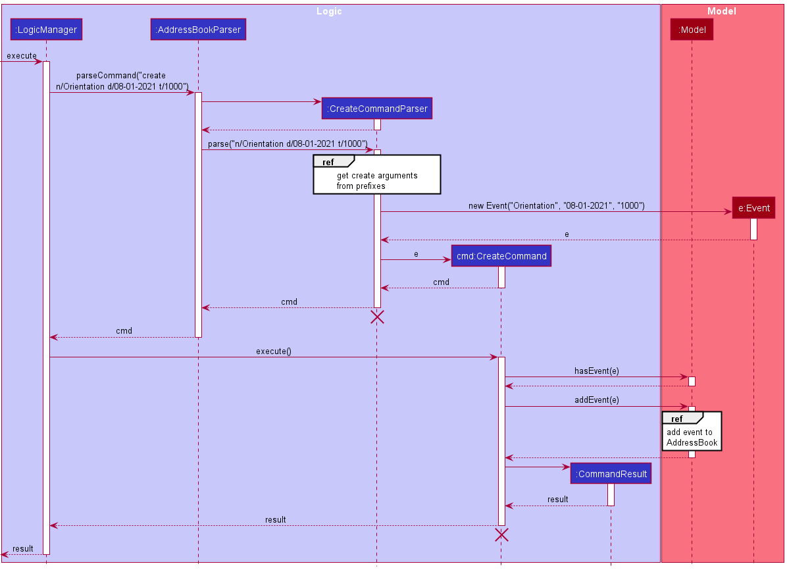
_Sequence diagram for creating an event_<br>

* Note that LogicManager is called using execute("create n/Orientation d/08-01-2021 t/1000"). This information was truncated to reduce clutter in the diagram.<br>
* The event is only added if there are no other events in the model that have the same name. This is checked using the `hasEvent` method.

The following sequence diagram shows how a create operation gets its arguments from the prefixes:

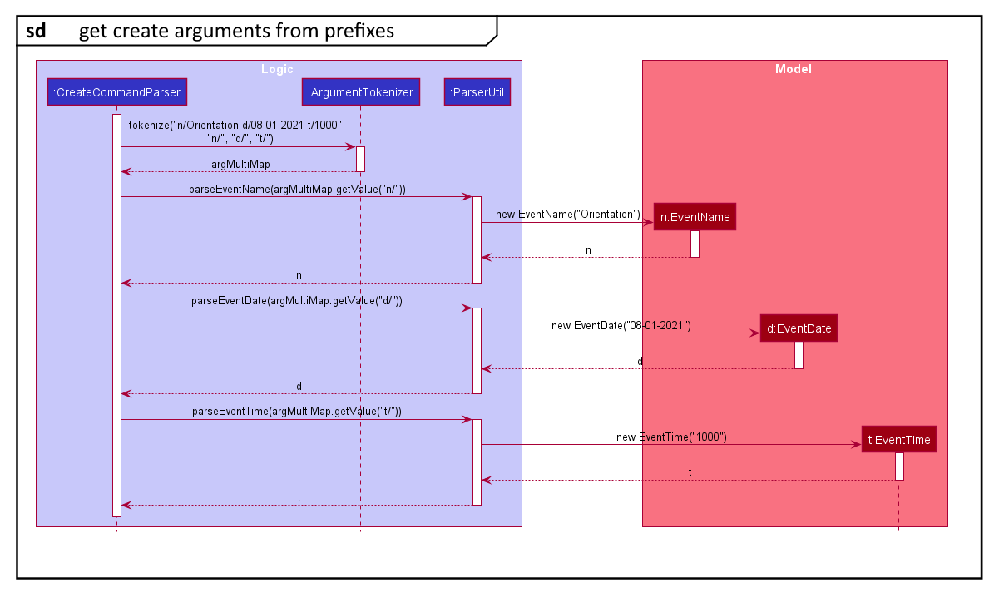
_Sequence diagram for parsing a create command's arguments_

AddressBook contains a UniqueEventList to hold a list of events. UniqueEventList implements the [`Iterable<Event>`](https://docs.oracle.com/en/java/javase/11/docs/api/java.base/java/lang/Iterable.html) interface and stores events in an [`ObservableList<Event>`](https://docs.oracle.com/javase/10/docs/api/javafx/collections/ObservableList.html).

The following sequence diagram shows how an event is added to the UniqueEventList through the Model:

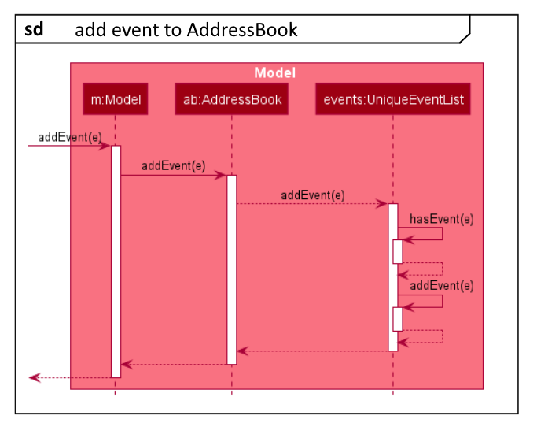 <br>
_Sequence diagram for adding an event to UniqueEventList_

* The UniqueEventList checks for duplicate events using the `hasEvent` method before adding the event.
* After the event is added, the UI is immediately updated and the new event is reflected as an `EventCard` in the `EventListPanel`.

### Enrolling a Student into an Event

This is a feature to allow the user to enroll a student into an event. Currently, the implementation allows for each student to be enrolled into any chosen event as long as 
he/she is not on that event's blacklist. A student could be enrolled into more than one event.

This feature comes with the following classes:
- nustracker.logic.commands.EnrollCommand
- nustracker.logic.parser.EnrollCommandParser

The following sequence diagram shows how the enroll operation works:
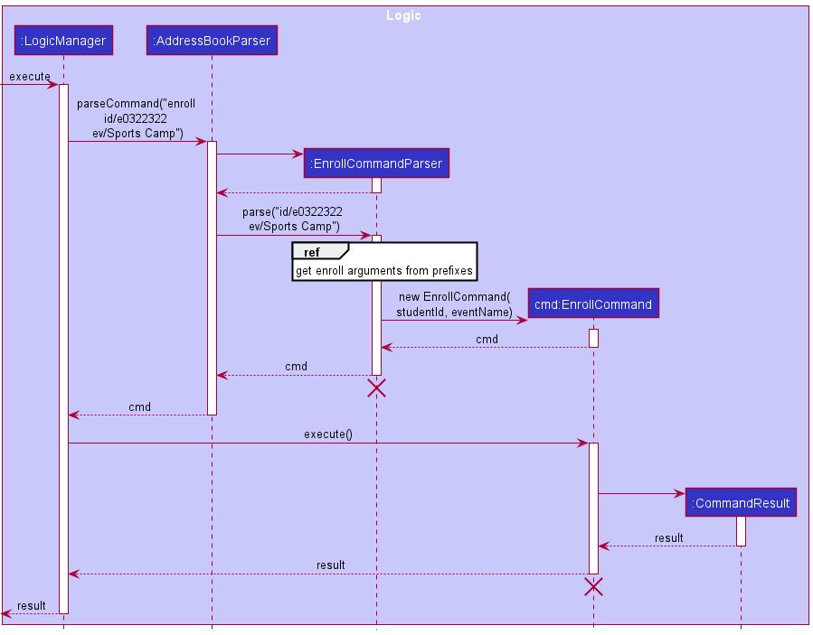
<br>_Sequence diagram for enrolling a student into an event_

* Note that LogicManager is called using execute("enroll id/e0322322 ev/Sports Camp"). This information was truncated to reduce clutter in the diagram.<br>
* For details of how the EnrollCommand internally enrolls a student into an event internally, please check out the activity diagram shown below.

The following sequence diagram shows how a enroll operation gets its arguments from the prefixes:

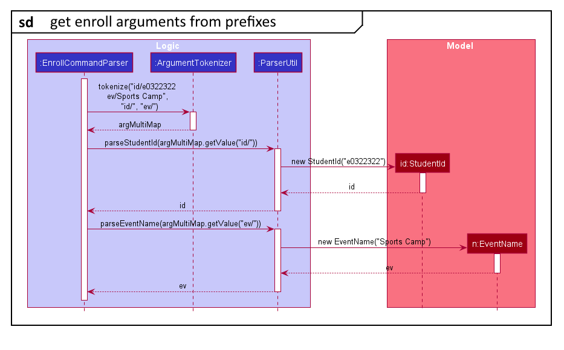
<br>_Sequence diagram for parsing enroll command arguments_

The following activity diagram shows how the enroll command enrolls a student into an event:
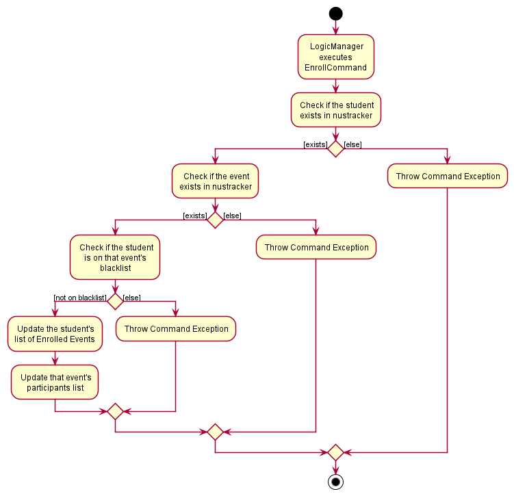
<br>_Activity diagram to show how the enroll command enrolls a student into an event_


### Filtering Feature

This is a feature to allow the user to filter the data by different fields. Currently, the implementation allows the user to filter by student IDs, names, majors, years, or event.

This feature comes with the following classes:
- nustracker.logic.commands.FilterCommand
- nustracker.logic.commands.FilterEventCommand
- nustracker.logic.commands.FilterIdCommand
- nustracker.logic.commands.FilterMajorCommand
- nustracker.logic.commands.FilterNameCommand
- nustracker.logic.commands.FilterYearCommand
- nustracker.logic.parser.FilterCommandParser
- nustracker.model.student.EnrolledEventsContainsKeywordsPredicate
- nustracker.model.student.MajorContainsKeywordsPredicate
- nustracker.model.student.NameContainsKeywordsPredicate
- nustracker.model.student.StudentIdContainsKeywordsPredicate
- nustracker.model.student.YearContainsKeywordsPredicate

The filter mechanism is facilitated by `FilterCommand`, an abstract class that extends `Command`.
Each field that can be used for filtering is created as a new child class which extends `FilterCommand` (e.x. filtering by name is implemented in `FilterNameCommand`).
Each one of these children classes has a predicate attribute which stores the keywords given by the user and uses them to filter the list of students.

The following class diagram gives an overview on the design of the `filter` command
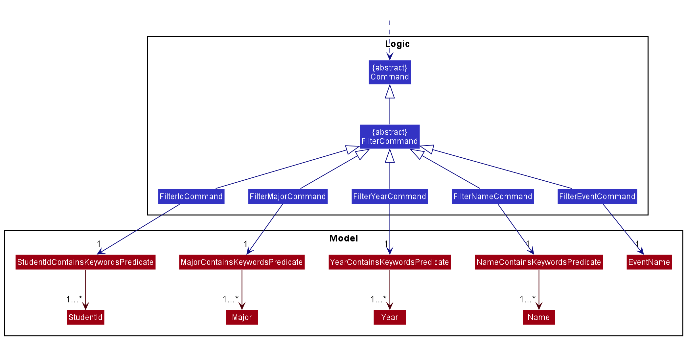
<br>_Class diagram for the filter command_

* Notes that `FilterEventCommand` is the only class which extends `FilterCommand` and does not store a predicate, but an `EventName` instead.

The following sequence diagram shows how filtering by student ID works:
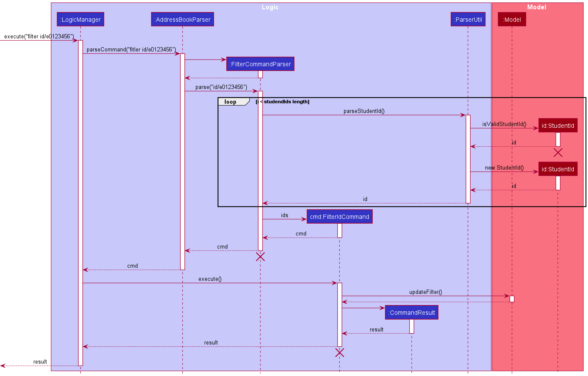
<br>_Sequence diagram for filtering by student ID_

* `FilterCommandParser` determines which field is used for filtering from the prefix that the user inputs (in this case the prefix is `id/`, hence `FilterCommandParser` calls `FilterIdCommand`)


### Exporting Feature

This is a feature to allow the user to export a given data field. Currently, the implementation only works for emails and can only export a csv file.

This feature comes with the following classes:
- nustracker.logic.commands.ExportCommand
- nustracker.logic.parser.ExportCommandParser
- nustracker.storage.Exporting


The following sequence diagram shows how the export operation works:

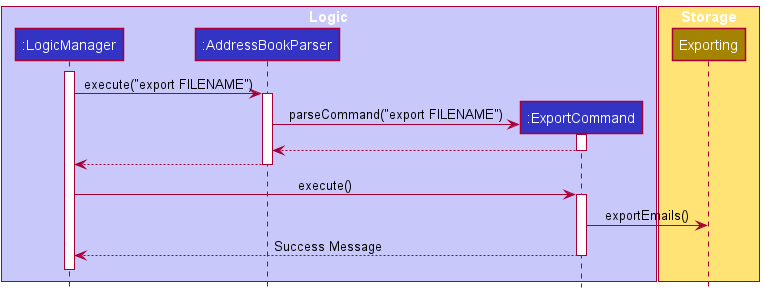
<br>_Sequence diagram for exporting_

#### Design Considerations
* **Alternative 1 (current choice)**: Parameters are passed to the Exporting class to instruct it on how and what to export. There is only 1 Exporting class with 1 method.
    * Pros: Commands are free from clutter, and all exporting changes are done in the Exporting class (i.e. formatting the string, choosing a filetype etc.)
    * Cons: The Exporting class might become convoluted and complicated as it gets updated in the future.
* **Alternative 2**: Each command manages its own formatting and passes the formatted content to Exporting class.
    * Pros: Exporting class will have a very specific purpose and is very clear.
    * Cons: Changes to a specific filetype might incur changes in many commands. (e.g. if the way that we export csv files is changed, then every command that exports as a csv file will have to change)
* **Alternative 3**: Exporting class is extended to accommodate for filetypes, and also accounts for the formatting of the data.
    * Pros: Very structured, easy to extend and add new commands that require export. Easy to add new filetypes for exporting and change which filetypes different commands use.
    * Cons: Takes longer to implement than the other 2 options

In the end the first choice was chosen as it was more structured, and take less time to implement than alternative 3. We would consider alternative 3 to be the best long term option, and would implement it as such if time permitted.


### \[Proposed\] Undo/redo feature

#### Proposed Implementation

The proposed undo/redo mechanism is facilitated by `VersionedAddressBook`. It extends `AddressBook` with an undo/redo history, stored internally as an `addressBookStateList` and `currentStatePointer`. Additionally, it implements the following operations:

* `VersionedAddressBook#commit()` — Saves the current address book state in its history.
* `VersionedAddressBook#undo()` — Restores the previous address book state from its history.
* `VersionedAddressBook#redo()` — Restores a previously undone address book state from its history.

These operations are exposed in the `Model` interface as `Model#commitAddressBook()`, `Model#undoAddressBook()` and `Model#redoAddressBook()` respectively.

Given below is an example usage scenario and how the undo/redo mechanism behaves at each step.

Step 1. The user launches the application for the first time. The `VersionedAddressBook` will be initialized with the initial address book state, and the `currentStatePointer` pointing to that single address book state.


Step 2. The user executes `delete id/e1234567` command to delete the student with student ID "e1234567" in the address book. The `delete` command calls `Model#commitAddressBook()`, causing the modified state of the address book after the `delete id/e1234567` command executes to be saved in the `addressBookStateList`, and the `currentStatePointer` is shifted to the newly inserted address book state.

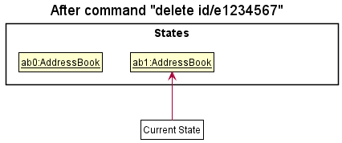

Step 3. The user executes `add n/David …​` to add a new student. The `add` command also calls `Model#commitAddressBook()`, causing another modified address book state to be saved into the `addressBookStateList`.


<div markdown="span" class="alert alert-info">:information_source: **Note:** If a command fails its execution, it will not call `Model#commitAddressBook()`, so the address book state will not be saved into the `addressBookStateList`.

</div><br>

Step 4. The user now decides that adding the student was a mistake, and decides to undo that action by executing the `undo` command. The `undo` command will call `Model#undoAddressBook()`, which will shift the `currentStatePointer` once to the left, pointing it to the previous address book state, and restores the address book to that state.


<div markdown="span" class="alert alert-info">:information_source: **Note:** If the `currentStatePointer` is at index 0, pointing to the initial AddressBook state, then there are no previous AddressBook states to restore. The `undo` command uses `Model#canUndoAddressBook()` to check if this is the case. If so, it will return an error to the user rather
than attempting to perform the undo.

</div>

The following sequence diagram shows how the undo operation works:


<div markdown="span" class="alert alert-info">:information_source: **Note:** The lifeline for `UndoCommand` should end at the destroy marker (X) but due to a limitation of PlantUML, the lifeline reaches the end of diagram.

</div>

The `redo` command does the opposite — it calls `Model#redoAddressBook()`, which shifts the `currentStatePointer` once to the right, pointing to the previously undone state, and restores the address book to that state.

<div markdown="span" class="alert alert-info">:information_source: **Note:** If the `currentStatePointer` is at index `addressBookStateList.size() - 1`, pointing to the latest address book state, then there are no undone AddressBook states to restore. The `redo` command uses `Model#canRedoAddressBook()` to check if this is the case. If so, it will return an error to the user rather than attempting to perform the redo.
</div><br>

Step 5. The user then decides to execute the command `events`. Commands that do not modify the address book, such as `events`, will usually not call `Model#commitAddressBook()`, `Model#undoAddressBook()` or `Model#redoAddressBook()`. Thus, the `addressBookStateList` remains unchanged.

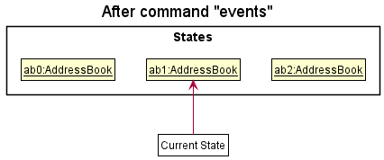

The following activity diagram summarizes what happens when a user executes a new command:


#### Design considerations:

**Aspect: How undo & redo executes:**

* **Alternative 1 (current choice):** Saves the entire address book.
    * Pros: Easy to implement.
    * Cons: May have performance issues in terms of memory usage.

* **Alternative 2:** Individual command knows how to undo/redo by
  itself.
    * Pros: Will use less memory (e.g. for `delete`, just save the student being deleted).
    * Cons: We must ensure that the implementation of each individual command are correct.

--------------------------------------------------------------------------------------------------------------------

## **Documentation, logging, testing, configuration, dev-ops**

* [Documentation guide](Documentation.md)
* [Testing guide](Testing.md)
* [Logging guide](Logging.md)
* [Configuration guide](Configuration.md)
* [DevOps guide](DevOps.md)

--------------------------------------------------------------------------------------------------------------------

## **Appendix: Requirements**

### Product scope

**Target user profile**:

* manpower and administrative personnel of NUS student organisations.
* has a need to manage the attendance of a significant number of students in their organisation.
* needs an app to collate their organisation's events and their corresponding manpower/participants information in one place.
* prefers desktop apps over other types.
* can type fast and prefers typing to mouse interactions.
* is reasonably comfortable using CLI apps.

**Value proposition**:

* able to store information of students in an NUS student organisation.
* create and track attendance for the organisation's events.
* manage attendance more efficiently and faster than a typical mouse/GUI driven app.
* automates the extraction of the contact details (like email) of an event's participants.


### User stories

Priorities: High (must have) - `* * *`, Medium (nice to have) - `* *`, Low (unlikely to have) - `*`

| Priority | As a …​                                    | I want to …​                     | So that I can…​                                                        |
| -------- | ------------------------------------------ | ------------------------------ | ---------------------------------------------------------------------- |
| `* * *`  | potential user                             | easily get the app running                  | quickly start using the App                 |
| `* * *`  | new user                                   | view a tutorial of basic commands           | learn how to use the software quickly |
| `* * *`  | new user                                   | view help screen                            | quickly refer to commands |
| `* * *`  | user                                       | view all the student data                   | keep track of all NUS undergraduate students                                   |
| `* * *`  | user                                       | view all events                             | keep track of the student events that the user manages                                   |
| `* * *`  | user                                       | exit the software                           | close the software |
| `* * *`  | user                                       | create a new student                        | add students newly admitted to NUS into the database |
| `* * *`  | user                                       | delete a student                            | delete students who have graduated from the database |
| `* * *`  | user                                       | create a new event                          | add new events to be managed using the app |
| `* * *`  | user                                       | delete an event                             | remove events that are no longer relevant |
| `* * *`  | user                                       | test the app using sample data              | test the app and its commands easily before loading in real student data |
| `* *  `  | intermediate user                          | edit student data                           | update previous mistake in data entry or update a change in student data |
| `* *  `  | expert user                                | export email of selected students           | use the email list to mass email relevant students |
| `* *  `  | expert user                                | export event data file                      | easily share or transfer event data to load in another computer |
| `* *  `  | expert user                                | export student data file                    | easily share or transfer the student database to load in another computer |
| `* *  `  | user                                       | blacklist students from events              | track which students are blacklisted from attending events |
| `* *  `  | user                                       | remove students from an event's blacklist   | allow that student to attend the event  |
| `* *  `  | user                                       | load student data from external file        | quickly add a large number of students |
| `* *  `  | user                                       | load event data file                        | update the list of events being managed in database |
| `* *  `  | user                                       | filter students by event                    | find students attending a particular event |
| `* *  `  | user                                       | filter students by year                     | select students who have certain years of seniority in NUS |
| `* *  `  | user                                       | view event list of student                  | see what events a student has attended before or are attending |
| `* *  `  | user                                       | filter students by major                    | find students of a particular major |
| `* *  `  | user                                       | filter students by faculty                  | find students from a particular faculty |
| `* *  `  | user                                       | open settings menu                          | adjust the settings of the app to my preferences |
| `* *  `  | user                                       | toggle between the events and students list | quickly and efficiently view the list I want to see |
| `* *  `  | user                                       | use auto save                               | save the database constantly and automatically                             |
| `*    `  | expert user                                | mass edit student data                      | update data of similar students more efficiently |


### Use cases

For all use cases below, the _System_ is **NUSTracker** and the _Actor_ is the **user**, unless specified otherwise.

**<u>Use case UC1 - Add a student</u>**

**Preconditions:** -

**Guarantees:** New student info is saved, and displayed.

**MSS:**
1. User types in command.
2. nustracker adds the user to the address book.
3. nustracker displays that user has been added, and corresponding details.<br>
   Use case ends

**Extensions:**
* 1a. User types in an invalid format
    * 1a1. nustracker shows an error message, and displays the correct format to use.<br>
      Use case ends.
  

* 1b. A student with the same student ID, phone number or email already exists in nustracker.
    * 1b1. nustracker shows an error message, and informs the user that a duplicate student already exists.<br>
      Use case ends.

<br>

**<u>Use case UC2 - Delete a student</u>**

**Preconditions:** -

**Guarantees:** Student is deleted from program, and display is updated

**MSS:**

1. User requests to delete a specific student in the list.
2. nustracker deletes the student, and informs user.<br>
    Use case ends.

**Extensions:**
* 1a. User types in an invalid format
    * 1a1. nustracker shows an error message, and displays the correct format to use.<br>
      Use case ends


* 1b. The student does not exist.
  * 1b1. nustracker shows an error message, informing the user that the student does not exist.<br>
    Use case ends.

<br>

**<u>Use case UC3 - Filter students by name</u>**

**Preconditions:** -

**Guarantees:** The list of students is not altered

**MSS:**

1.  User requests to filter students by multiple names.
2.  nustracker displays a list of students whose names contain the specified keywords.<br>
    Use case ends.

**Extensions:**
* 1a. User types an incorrect format of the command.
    * 1a1. nustracker shows an error message with the correct format of the command.<br>
        Use case ends.
  

* 2a. nustracker does not find students with the specified name.
    * 2a1. nustracker displays an empty list.<br>
      Use case ends.
  
<br>

**<u>Use case UC4 - Filter students by student ID</u>**

**Preconditions:** -

**Guarantees:** The list of students is not altered

**MSS:**

1.  User requests to filter students by multiple student IDs.
2.  nustracker displays a list of students whose student IDs contains the specified keywords.<br>
    Use case ends.

**Extensions:**
* 1a. User types an incorrect format of the command.
    * 1a1. nustracker shows an error message with the correct format of the command.<br>
      Use case ends.


* 1b. User types multiple prefixes to filter by.
    * 1b1. nustracker shows an error message.<br>
      Use case ends.


* 2a. The list of students is empty.<br>
  Use case ends.
 

* 2b. nustracker does not find students with the specified Student IDs.
    * 2b1. nustracker displays an empty list.<br>
        Use case ends.
        
      
<br>

**<u>Use case UC5 - Find the students attending a certain event</u>**

**Preconditions:** -

**Guarantees:** The list of students is not altered

**MSS:**

1.  User requests to filter students by event name.
2.  nustracker displays a list of students who are attending that event.<br>
    Use case ends.


**Extensions:**
* 1a. User types an incorrect format of the command.
    * 1a1. nustracker shows an error message with the correct format of the command.<br>
      Use case ends.


* 1b. User types multiple prefixes to filter by.
    * 1b1. nustracker shows an error message.<br>
      Use case ends.


* 2a. The list of students is empty.<br>
  Use case ends.
 

* 2b. nustracker does not find any students attending the specified event.
    * 2b1. nustracker displays an empty list.<br>
        Use case ends.


<br>

**<u>Use case UC6 - Filter students by year</u>**

**Preconditions:** -

**Guarantees:** The list of students is not altered

**MSS:**

1.  User requests to filter students by year.
2.  nustracker displays a list of students who are studying in that year.<br>
    Use case ends.

**Extensions:**
* 1a. User types an incorrect format of the command.
    * 1a1. nustracker shows an error message with the correct format of the command.<br>
      Use case ends.


* 1b. User types multiple prefixes to filter by.
    * 1b1. nustracker shows an error message.<br>
      Use case ends.


* 1c. User enters an invalid value for year.
    * 1c1. nustracker shows an error message.<br>
      Use case ends.


* 2a. The list of students is empty.<br>
  Use case ends.


* 2b. nustracker does not find any students studying in the specified year.
    * 2b1. nustracker displays an empty list.<br>
        Use case ends.
    

<br>

**<u>Use case UC7 - Filter students by major</u>**

**Preconditions:** -

**Guarantees:** The list of students is not altered

**MSS:**

1.  User requests to filter students by majors.
2.  nustracker displays a list of students who are studying the specified major.<br>
    Use case ends.

**Extensions:**
* 1a. User types an incorrect format of the command.
    * 1a1. nustracker shows an error message with the correct format of the command.<br>
      Use case ends.

      
* 1b. User types multiple prefixes to filter by.
    * 1b1. nustracker shows an error message.<br>
      Use case ends.


* 1c. User enters an invalid major.
    * 1c1. nustracker shows an error message.<br>
      Use case ends.


* 2a. The list of students is empty.<br>
  Use case ends.
 

* 2b. nustracker does not find any students studying the specified major.
    * 2b1. nustracker displays an empty list.<br>
        Use case ends.
    

<br>

**<u>Use case UC8 - Create an event</u>**

**Preconditions:** -

**Guarantees:** New event info is saved, and displayed

**MSS:**

1. User types in command.
2. nustracker adds the event to the address book.
3. nustracker displays that the event has been added, and corresponding details.<br>
    Use case ends.

**Extensions:**
* 1a. User types in an invalid format
  * 1a1. nustracker shows an error message, and displays the correct format to use.<br>
    Use case ends.


* 1b. An event with the same name already exists in the address book.
  * 1b1. nustracker shows an error message, informing the user that an event with the same name already exists.<br>
    Use case ends.

<br>

**<u>Use case UC9 - Delete an event</u>**

**Preconditions:** -

**Guarantees:** Event is deleted from program, and display is updated

**MSS:**

1. User types in command.
2. nustracker deletes the event from the address book.
3. nustracker displays that the event has been deleted, and corresponding details.
4. nustracker updates the students who are enrolled in the deleted event.<br>
   Use case ends.

**Extensions:**
* 1a. User types in an invalid format
  * 1a1. nustracker shows an error message, and displays the correct format to use.<br>
      Use case ends.


* 1b. The event does not exist in the address book.
    * 1b1. nustracker shows an error message, informing the user that the event does not exist.<br>
    Use case ends.


<br>

**<u>Use case UC10 - Blacklist a student</u>**

**Preconditions:** -

**Guarantees:** Student is blacklisted from the event, and display is updated

**MSS:**

1. User types in command.
2. nustracker adds student to the event's blacklist.
3. nustracker displays that the student has been blacklisted.<br>
   Use case ends.

**Extensions:**
* 1a. User types in an invalid format
    * 1a1. nustracker shows an error message, and displays the correct format to use.<br>
      Use case ends.


* 1b. The event does not exist in the address book.
    * 1b1. nustracker shows an error message, informing the user that the event does not exist.<br>
      Use case ends.


* 1c. The student is already in the event's blacklist.
    * 1c1. nustracker shows an error message, informing the user that the student is already in the event's blacklist.<br>
      Use case ends.


* 1d. The student is enrolled in the event.
    * 1d1. nustracker shows an error message, informing the user that the student is enrolled in the event.<br>
      Use case ends.


<br>

**<u>Use case UC11 - Whitelist a student</u>**

**Preconditions:** -

**Guarantees:** Student is removed from the event's blacklist, and display is updated

**MSS:**

1. User types in command.
2. nustracker removes student from the event's blacklist.
3. nustracker displays that the student has been removed from the blacklist.<br>
   Use case ends.

**Extensions:**
* 1a. User types in an invalid format
    * 1a1. nustracker shows an error message, and displays the correct format to use.<br>
      Use case ends.


* 1b. The event does not exist in the address book.
    * 1b1. nustracker shows an error message, informing the user that the event does not exist.<br>
      Use case ends.


* 1c. The student is not in the event's blacklist.
    * 1c1. nustracker shows an error message, informing the user that the student is not in the event's blacklist.<br>
      Use case ends.
  

<br>

**<u>Use case UC12 - Enroll a student into an event</u>**

**Preconditions:** -

**Guarantees:** The student gets enrolled into the specified event if both the student and event exist. 

**MSS:**

1.  User requests to enroll a student into an event.
2.  nustracker updates the event to have this student as a participant.
3.  nustracker updates the student to be enrolled into this event.
4.  nustracker shows that the student has now been enrolled.<br>
    Use case ends.

**Extensions:**
* 1a. User types in an invalid format.
  * 1a1. nustracker shows an error message, and displays the correct format to use.<br>
  Use case ends.


* 1b. The specified student does not exist in nustracker.
    * 1b1. nustracker shows an error message, informing the user that the specified student does not exist.<br>
    Use case ends.


* 1c. The specified event does not exist in nustracker.
    * 1c1. nustracker shows an error message, informing the user that the specified event does not exist.<br>
  Use case ends.


* 1d. The specified student is currently already enrolled into the event.
    * 1d1. nustracker shows an error message, informing the user that the specified student is already currently enrolled.<br>
  Use case ends.


<br>

**<u>Use case UC13 - Remove a student from an event</u>**

**Preconditions:** -

**Guarantees:** The student is not enrolled into the specified event after the use case ends.

**MSS:**

1.  User requests to remove a student from an event.
2.  nustracker updates the event to remove this student from being a participant.
3.  nustracker updates the student to not be enrolled into this event anymore.
4.  nustracker shows that the student has now been removed from the event.<br>
    Use case ends.

**Extensions:**
* 1a. User types in an invalid format.
    * 1a1. nustracker shows an error message, and displays the correct format to use.<br>
      Use case ends.
    

* 1b. The specified student does not exist in the nustracker.
    * 1b1. nustracker shows an error message, informing the user that the specified student does not exist.<br>
  Use case ends.


* 1c. The specified event does not exist in the nustracker.
    * 1c1. nustracker shows an error message, informing the user that the specified event does not exist.<br>
Use case ends.


* 1d. The specified student is not currently enrolled into the event.
    * 1d1. nustracker shows an error message, informing the user that the specified student cannot be removed from the event as the student is not a participant.<br>
Use case ends.


<br>

**<u>Use case UC14 - Exporting emails</u>**

**Preconditions:** -

**Guarantees:** -

**MSS:**

1. User requests to export emails from a list of students and provides the name of the file to save it in.
2. nustracker exports the emails and places them in a save file.
3. nustracker shows a confirmation message that the emails have been successfully exported.<br>
    Use case ends.

**Extensions:**
* 1a. User types in an invalid format.
    * 1a1. nustracker shows an error message, and displays the correct format to use.<br>
      Use case ends.


* 1b. User types in an invalid name for the save file.
    * 1b1. nustracker shows an error message, informing the user that the file name they have chosen is invalid.<br>
  Use case ends.
    

<br>

**<u>Use case UC15 - Display event/student list</u>**

**Preconditions:** -

**Guarantees:** The full unfiltered event/student list is displayed.

**MSS:**

1. User enters a command to show event/student list.
2. nustracker shows the full unfiltered event/student list.<br>
   Use case ends.

**Extensions:**
* 1a. User types in an invalid format.
    * 1a1. nustracker shows an error message, and displays the correct format to use.<br>
      Use case ends.


* 2a. The student list is filtered by a previous filter command.
    * 2a1. nustracker overwrites the filter, and displays the full unfiltered student list.<br>
      Use case ends.


<br>

### Non-Functional Requirements

1.  Should work on any _mainstream OS_ as long as it has Java `11` or above installed.
1.  Should be able to hold up to 40000 students and still be able to respond to user input within 2 seconds.
1.  Should be able to hold a reasonable amount of events without any degradation in performance.
1.  A user with above average typing speed for regular English text (i.e. not code, not system admin commands) should be able to accomplish most of the tasks faster using commands rather than using the mouse.
1.  Should be able to save all data on local storage.
1.  The application should work without having to be installed first.


### Glossary

* **Mainstream OS**: Windows, Linux, Unix, OS-X
* **Command-Line Interface**: A text-based user interface allowing users to interact with applications by typing commands.
* **Graphical User Interface**: A graphical user interface that allows users to interact with applications through the use of interactive visuals.
* **NUS**: An abbreviation for National University of Singapore.

--------------------------------------------------------------------------------------------------------------------

## **Appendix: Instructions for manual testing**

Given below are instructions to test the app manually.

<div markdown="span" class="alert alert-info">:information_source: **Note:** These instructions only provide a starting point for testers to work on;
testers are expected to do more *exploratory* testing.

</div>

### Launch and shutdown

1. Initial launch

    1. Download the jar file and copy into an empty folder

    2. Double-click the jar file. <br>
   Expected: Shows the GUI with a set of sample contacts. The window size may not be optimum.

1. Saving window preferences

    1. Resize the window to an optimum size. Move the window to a different location. Close the window.

    1. Re-launch the app by double-clicking the jar file.<br>
       Expected: The most recent window size and location is retained.

## Manual test cases:

#### Create an event
0. Assumptions: Sample data is loaded / Orientation Camp event exists in app.
1. Test case 1: `create n/Orientation Camp d/10-08-2022 t/1030`
   1. Expected: Error message saying event already exists is displayed.
2. Test case 2: `create n/Practical Exam d/14-11-2021 t/1700`
   1. Expected: Practical Exam event is created and displayed at the bottom of event list.

#### Enrolling a student
0. Assumptions: Sample data is loaded / Sports Camp event and Student with student ID e1234567 exist in app.
1. Test case 1: `enroll id/e1234567 ev/This event does not exist`
   1. Expected: Error message saying event does not exist is displayed.
2. Test case 2: `enroll id/e1234567 ev/Sports Camp`
    1. Expected: Student is enrolled into the Sports Camp event and student ID e1234567 is displayed in its enrolled list.

#### Deleting an event
0. Assumptions: Sample data is loaded / Math Olympiad event exists in app.
1. Test case 1: `delete ev/This event does not exist`
    1. Expected: Error message saying event does not exist is displayed.
2. Test case 2: `delete ev/Math Olympiad`
    1. Expected: The Math Olympiad event is deleted and removed from the event list.

#### Deleting a student

0. Assumptions: Sample data is loaded / Student with student ID e1234567 exists in app.
1. Test case 1: `delete id/e1234567 ev/Orientation Camp`
   1. Expected: Error message saying delete command can only delete either a student or event at one time is displayed.
2. Test case 2: `delete id/e1234567`
   1. Expected: Student with student ID "e1234567" is deleted and removed from the student list.

#### Exporting a list of emails
0. Assumptions: Sample data is loaded / The currently displayed student list is not empty.
1. Test case 1: `export fn/Emails`
   1. Expected: A file Emails.csv is created in the /data folder in your root directory where the app is run. The file will contain all the emails of the displayed students.

#### Test command inputs
1. Test extraneous prefixes:
   1. `students n/abc`: command ignores prefix and executes as expected
   2. `create n/Test event d/07-11-2021 t/1135 m/CS`: command does not accept extra prefixes and displayed invalid command message
   3. `add n/Jeremy m/CS id/e9556882 y/4 p/90121325 e/jeremy@u.nus.edu p/84756230`: command takes the latest prefix and creates a new student with phone number 84756230

    
2. Test invalid prefixes
   1. `delete id/1234567`: student ID requires an 'e' in front of 7 digits
   2. `blacklist id/e1234567 ev/Orientation Camp!`: event name only allows alphanumeric characters and spaces
   3. `add n/June m/BZA id/e8112233 y/1 p/81236540 e/june@a`: email's domain (after @) has to be at least 2 characters long

### Local Save File

<div markdown="span" class="alert alert-info"> :label: **Note:** Before attempting these test cases related to the local save file, please
 set up **nustracker** to contain the sample data beforehand for the best experience. To do this, just delete the save file
named `addressbook.json` in the data folder, then open **nustracker** and type in a command to save the sample data into a save file.
</div>

1. Proper handling of a corrupted JSON save file

    1. Go to the folder containing the save data (The folder named: data) and open `addressbook.json`.

    1. Choose a comma in the file and add a close curly brace character to the right of it like this: `,}`. Save your edits.

    1. Re-launch the app by double-clicking the jar file.<br>
       Expected: **nustracker** will not be able to load the data and the student and event lists are blank.


1. Proper handling of a JSON save file with missing data

    1. Go to the folder containing the save data (The folder named: data) and open `addressbook.json`.

    1. Choose a student in the file and delete one or more of the lines containing student data.

    1. Re-launch the app by double-clicking the jar file.<br>
       Expected: **nustracker** will not be able to load the data and the student and event lists are blank.


1. Proper handling of a JSON save file with conflicting data

   i. Go to the folder containing the save data (The folder named: data) and open `addressbook.json`.

   ii. Choose a student in the file and take note of his/her student ID.

   iii. Choose an event in the file, and add this student ID into both the participants list as well as the blacklist.

   iv. If we choose a student with student ID `e0123456` and the event `Physics Camp`, the data in the JSON file should look like this:
   <br>

    ```
   Before:
    "participants" : [ ],
    "blacklist" : [ ]
    ```

    ```
   After:
    "participants" : [ "e0123456" ],
    "blacklist" : [ "e0123456" ]
    ```

   v. Re-launch the app by double-clicking the jar file.<br>
   Expected: **nustracker** will not be able to load the data and the student and event lists are blank.


