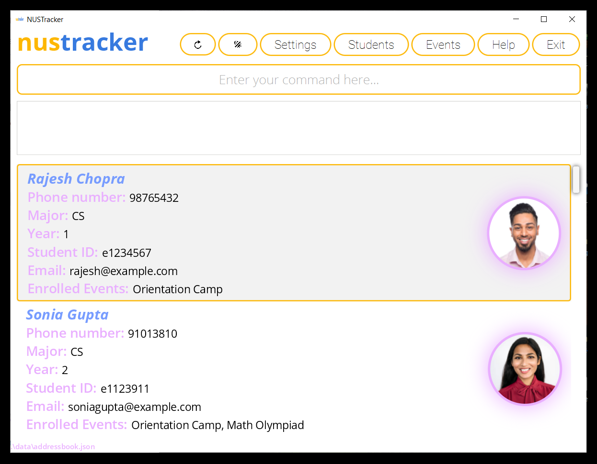

**nustracker is a desktop application for NUS event directors and student leaders of student organizations in NUS School of Computing to keep track and manage events that their members are a part of.** While it has a GUI, most of the user interactions happen using a CLI (Command Line Interface).

## What nustracker can do:
1. Keep track of students
2. Keep tracks of events and event attendance
3. Keep track of event blacklists
4. Easily export e-mails of a group of students
5. Be customized to the user’s liking

------

### Getting Started With nustracker
If you are interested in using nustracker, head over to the [_Quick Start_ section of the **User Guide**](UserGuide.html#quick-start).

### Developer Guide
If you are interested about developing nustracker, the [**Developer Guide**](DeveloperGuide.html) is a good place to start.

### About Us
If you are interested in learning about the team behind nustracker, head over to the [**About Us** page](AboutUs.html).

### Acknowledgements

* Libraries used: [JavaFX](https://openjfx.io/), [Jackson](https://github.com/FasterXML/jackson), [JUnit5](https://github.com/junit-team/junit5)
